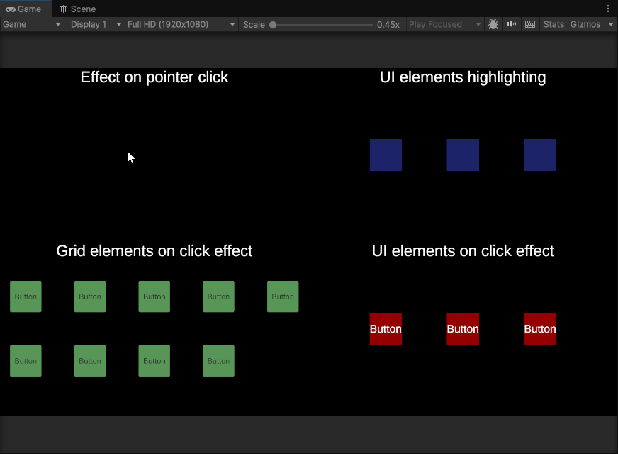

# ParticleSystemInUI Toolkit

A complete solution for rendering **Particle System effects on Unity UI** without the limitations of standard approaches. Perfect for click effects, hover highlights, interactive feedback, and any other particle-based UI animations.

## 🎯 The Problem

Unity's UI system (Canvas) does not natively support Particle System rendering. Standard solutions like setting `Render Mode = Screen Space Overlay` don't work, and particles either disappear or render behind UI elements.

## ✨ The Solution

This toolkit provides:

- **RenderTexture-based rendering** - Particle systems are captured by a dedicated camera and displayed via RawImage on UI
- **Layout group support** - Effects can be displayed inside Layout Groups without breaking layout calculations
- **Multi-effect support** - Display multiple effects simultaneously (multiple clicks, etc.)

## 🚀 Features

| Feature | Description |
|---------|-------------|
| 🎨 **UI Effects** | Click effects, hover highlights, interaction feedback |
| 📐 **Layout Groups** | Effects don't interfere with Layout Group calculations |
| 🎯 **Pooling System** | Prevents GC and improves performance |
| ⚡ **Auto Setup** | Automatically creates required layers |
| 📦 **Unity Package** | Ready to import via .unitypackage |

## 📋 Requirements

- Unity **2022** or **2023** or **6000+**
- Universal Render Pipeline (URP) recommended
- No additional assets required

## 🔧 Installation

### Option 1: Direct Download

1. Download the latest `.unitypackage` from [Releases](https://github.com/ForsakenAginor/ParticleSystemInUI/releases)
2. Import into your project: `Assets → Import Package → Custom Package`

### Option 2: Manual Installation

1. Clone or download the repository
2. Copy the contents to your `Assets` folder

## 🎮 Quick Start



### Demo Scene

To see how the toolkit works in action, open the **demo scene** included in the package. The demo scene demonstrates:
- Click effects on buttons
- Hover highlight effects
- Multiple simultaneous effects
- Proper layout group behavior

### Adding Effects to Your UI

To add new functionality or modify existing behavior, you need to modify the `UIEffectAdapter` class. This class is the main entry point for playing effects:

```csharp
// The UIEffectAdapter controls all effect playback
// Available methods:
// - PlayEffect(parent, size)
// - PlayHighlightEffect(parent, size)  
// - PlayClickEffect(parent, position, size)
// - StopAllEffects()
